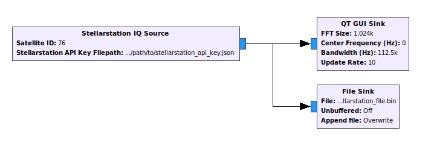
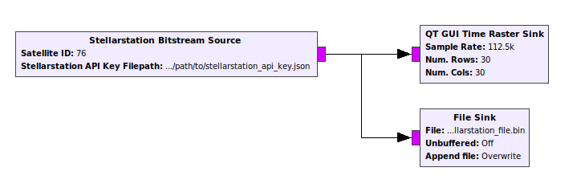

# gr-stellarstation: GNURadio blocks for interacting with Stellarstation

gr-stellarstation is an out-of-tree GNURadio module that provides blocks for easily integrating with the [Stellarstation](stellarstation.com) API in GNURadio flowgraphs.

## Installation

### PyBOMBS

PyBOMBs support is currently under construction.

### Source Installation

gr-stellarstation, like most OOT modules, can be built from source using CMake.

First, we need to install gr-stellarstation's sole dependency, [Conan](https://conan.io/). The simplest way to do this is through `pip`:

```bash
$ pip install conan
```

For alternative methods to install Conan, see the [Conan documentation](https://docs.conan.io/en/latest/installation.html).

After installing Conan, run the following commands to add the relevant Conan recipes:

```bash
$ conan remote add bincrafters https://api.bintray.com/conan/bincrafters/public-conan
$ conan remote add inexorgame https://api.bintray.com/conan/inexorgame/inexor-conan
$ conan remote add stellarstation https://api.bintray.com/conan/infostellarinc/stellarstation-conan
```

Proceed to install gr-stellarstation normally with CMake:

```bash
$ git clone https://github.com/infostellarinc/gr-stellarstation.git
$ cd gr-stellarstation
$ mkdir build
$ cmake ..
$ make
$ sudo make install
$ sudo ldconfig
```

## Examples

See the [examples directory](examples/) for flowgraphs showing the usage of gr-stellarstation blocks.

## Stellarstation API Key

To use most of the blocks in this module, you will need a Stellarstation API Key, which is a .json file containing credentials to access the Stellarstation API. You can request one from <https://www.stellarstation.com/>.

## Quickstart

A typical use case of gr-stellarstation is direct streaming of complex I/Q data from a satellite tracked by Stellarstation to a GNURadio flowgraph in real-time.

gr-stellarstation provides the block **Stellarstation IQ Source** for this purpose.



Note that we've configured the block to connect to *Satellite ID* "73" (corresponding to the weather satellite [NOAA 19](https://en.wikipedia.org/wiki/NOAA-19)) and given it the path of the Stellarstation API Key via *Stellarstation API Key Filepath*.

When this flowgraph runs, the block opens a stream to the Stellarstation API, and converts all IQ packets received to a complex stream that can be used in downstream GNURadio blocks. We can display a live waterfall plot, save the stream to file, demodulate the data, or anything else GNURadio lets us do!

Here are a few more things to keep in mind about our flowgraph:
* The sampling rate of the received stream is satellite-dependent. Currently, most amateur satellites that Stellarstation tracks are sampled at 112500Hz.
* If a pass is not currently running, the Stellarstation API will return no data, and your flowgraph will not do anything.
* Depending on both the ground station's and the user's internet speed, samples may not be received in realtime. For example, to support streaming 112500Hz raw I/Q data in realtime, the ground station and the user need to support approximately ~1MBps upload and download speed, respectively. If either one is slower, the packets will still arrive in order without data loss, but  will no longer be in realtime.

For other satellites, Stellarstation does demodulation directly on the ground station and streams back the demodulated bitstream. For users that wish to access this data, gr-stellarstation provides the **Stellarstation Bitstream Source** block.


